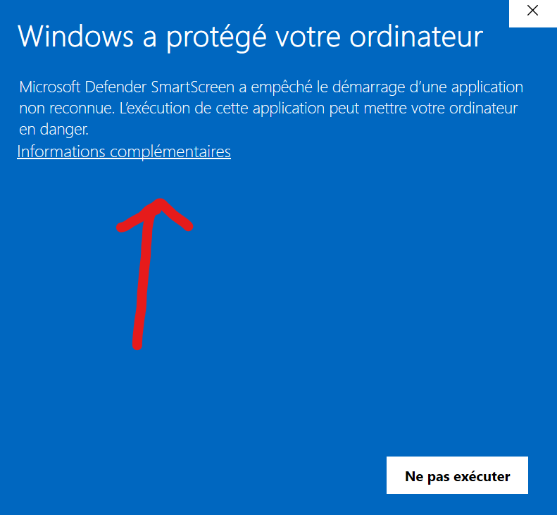
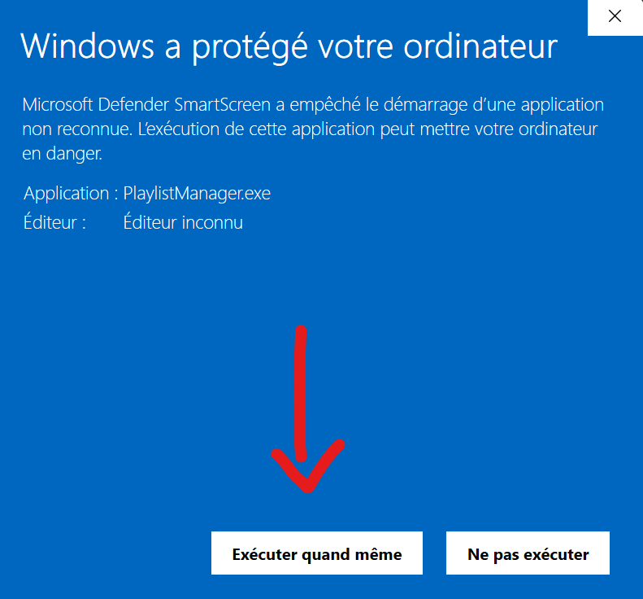
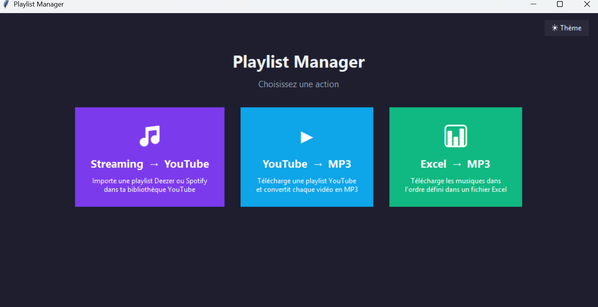
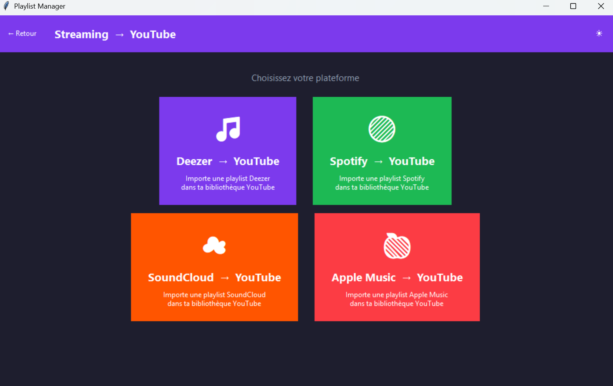

# Playlist Manager

Application Windows avec interface graphique pour télécharger et gérer des playlists musicales.

## Téléchargement

Dernière version : **v2.0.0**  
**[⬇ Télécharger PlaylistManager.exe](https://github.com/Yma061/playlist-mp3-downloader/releases/download/v2.0.0/PlaylistManager.exe)**

> Windows uniquement — aucune installation requise, double-cliquez pour lancer.

### ⚠️ Avertissement Windows au premier lancement

Windows peut afficher un message de sécurité car le fichier n'est pas signé par un éditeur certifié. C'est normal pour une application indépendante.

**Pour lancer l'application :**

1. Clique sur **"Informations complémentaires"**

   

2. Clique sur **"Exécuter quand même"**

   

> Le fichier est open source — tu peux inspecter l'intégralité du code dans ce dépôt.

---

## Aperçu





---

## Fonctionnalités

### 🎵 Streaming → YouTube
Importe une playlist depuis ta plateforme préférée dans ta bibliothèque YouTube.

| Plateforme | API requise | Compte développeur |
|---|---|---|
| Deezer | Non | Non |
| Spotify | Non | Non |
| SoundCloud | Non | Non |
| Apple Music | Non | Non |

- Connexion Google intégrée — une fenêtre s'ouvre dans le navigateur au premier lancement
- Reprise automatique si la limite quotidienne de l'API est atteinte
- Limite : ~66 titres/jour (quota Google de 10 000 unités/jour)

### ▶ YouTube → MP3
Télécharge une playlist YouTube complète et convertit chaque vidéo en MP3 (192 kbps).
- Fichiers numérotés dans l'ordre de la playlist

### 📊 Excel → MP3
Télécharge des musiques dans l'ordre défini dans un fichier Excel.
- Détection automatique des feuilles, choix de la colonne et de la ligne de départ
- Pause aléatoire entre chaque titre pour éviter les blocages YouTube
- Fichier `non_trouves.txt` généré si des titres n'ont pas été trouvés
- Bouton "Réessayer les titres manquants" pour relancer uniquement les échecs

---

## Interface

- Thème clair / sombre
- Langue FR / EN
- Barre de progression avec estimation du temps restant (ETA)
- Historique des 5 derniers téléchargements sur la page d'accueil
- Ouverture du dossier de sortie en un clic
- Notification sonore à la fin de chaque traitement

---

## Utilisation

### Streaming → YouTube
1. Lance l'application
2. Clique sur **Streaming → YouTube**
3. Choisis ta plateforme (Deezer, Spotify, SoundCloud ou Apple Music)
4. Colle l'URL ou l'ID de ta playlist
5. Clique sur **Lancer** — une fenêtre de connexion Google s'ouvre au premier lancement
6. La connexion est mémorisée pour les prochaines fois

### YouTube → MP3
1. Clique sur **YouTube → MP3**
2. Colle l'URL de la playlist YouTube
3. Clique sur **Lancer** — les MP3 sont sauvegardés dans `playlists/`

### Excel → MP3
1. Clique sur **Excel → MP3**
2. Sélectionne ton fichier Excel via **Parcourir...**
3. Choisis la feuille, la colonne et la première ligne de données
4. Entre un nom de playlist et clique sur **Lancer**

---

## Installation depuis les sources

```bash
pip install -r requirements.txt
python interface.py
```

### Build .exe

```bash
pyinstaller PlaylistManager.spec
```

---

## Technologies

Python · Tkinter · yt-dlp · spotdl · Deezer API · Spotify · SoundCloud · Apple Music · YouTube Data API v3 · openpyxl · keyring · PyInstaller
